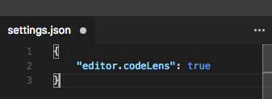
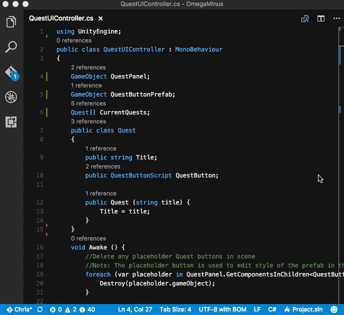
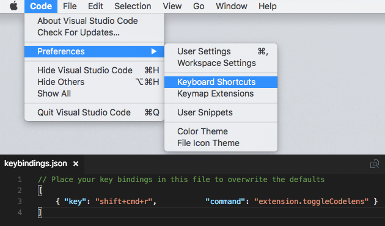

# vscode-togglecodelens

Simple extension to allow the toggle of the `editor.codeLens` setting inside `settings.json` for VS Code.

## Features

This extension toggles `editor.codeLens` item in `settings.json` between `true` and `false`. This allows you to Enable and Disable CodeLens with ease while writing code without having to open your `settings.json`.

>
> Tip: Keybind `extension.toggleCodelens` for easy access.
> 
>

## Installation

* Press (⌘+P) and use the following command `ext install vscode-togglecodelens`
* OR... Run `code --install-extension cmlewis89.vscode-togglecodelens` from terminal
* OR... Find it on the Visual Studio Market Place: https://marketplace.visualstudio.com/items?itemName=cmlewis89.vscode-togglecodelens

## Notes

Consider making a backup of settings.json.

* **Windows**: `%APPDATA%\Code\User\settings.json` or `%APPDATA%\Roaming\Code - Insiders\User\settings.json`
* **Mac**: `$HOME/Library/Application Support/Code/User/settings.json` or `$HOME/Library/Application Support/Code - Insiders/User/settings.json`
* **Linux**: `$HOME/.config/Code/User/settings.json` or `$HOME/.config/Code - Insiders/User/settings.json`

## Thanks

This extension is basically a fork of [jsturtevant](https://github.com/jsturtevant)'s [vscode-softwrap](https://github.com/jsturtevant/vscode-softwrap).

## Changelog

* 1.0.3 - 2017/01/30 
  * Inital Release
    
## License

This extension is licensed under the MIT License.

**Enjoy!**